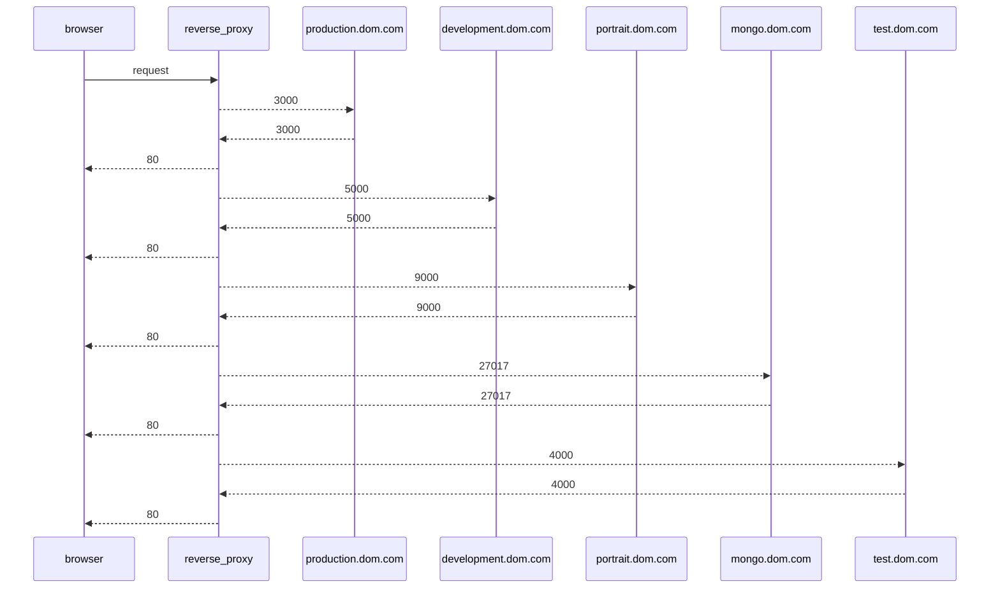

# Welcome to caym-aqrquitecture!

# Requirements

you need
NodeJs > 14
NPM
Docker

## Deploy enviroments (linux)

    sudo sh deploy.sh

## UML diagrams

Wrong diagram i know, but it's tmp.

```mermaid
sequenceDiagram
browser ->> reverse_proxy: request
reverse_proxy-->> production.dom.com: 3000
production.dom.com -->> reverse_proxy  : 3000
reverse_proxy-->> browser: 80

reverse_proxy-->> development.dom.com: 5000
development.dom.com -->> reverse_proxy  : 5000
reverse_proxy-->> browser: 80

reverse_proxy-->> portrait.dom.com: 9000
portrait.dom.com -->> reverse_proxy  : 9000
reverse_proxy-->> browser: 80

reverse_proxy-->> mongo.dom.com: 27017
mongo.dom.com -->> reverse_proxy  : 27017
reverse_proxy-->> browser: 80

reverse_proxy-->> test.dom.com: 4000
test.dom.com -->> reverse_proxy  : 4000
reverse_proxy-->> browser: 80

```
